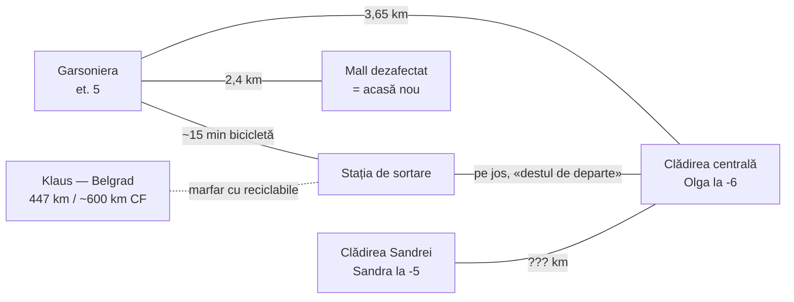

# Biblia romanului „Era atât de frig..."

*Document de lucru — Cezar (autor) & Senin (vocea Olgăi + redactor critic)*

## Structura proiectului

```
Romane/Era atat de frig/
├── BIBLIA_ROMANULUI.md     ← acest document (personaje, reguli, cronologie)
├── original/               ← docx-ul sursă (backup, nu se editează)
└── manuscris/              ← capitolele în Markdown (aici se scrie)
    ├── cap-01-olga.md      (~4.950 cuvinte)
    ├── cap-02-mall.md      (~3.280 cuvinte)
    └── cap-03-sandra.md    (~2.580 cuvinte)
```

## Versionare (git)

Repo-ul e deja pe git — manuscrisul în Markdown se versionează natural (diff pe text, nu pe binar ca docx).

**Fluxul de lucru:**
1. Scrii direct în `manuscris/cap-XX-nume.md`
2. La finalul fiecărei sesiuni de scris: `git add` + commit cu mesaj scurt
   ```
   git add "Romane/Era atat de frig" && git commit -m "roman: cap IV — scena cu Peter"
   ```
3. La fiecare draft complet, un tag:
   ```
   git tag roman-v0.1    # primul draft complet
   git tag roman-v0.2    # după prima rescriere
   ```
4. `git log --oneline -- "Romane/Era atat de frig"` = istoria completă a romanului
5. Recuperare versiune veche: `git show roman-v0.1:"Romane/Era atat de frig/manuscris/cap-01-olga.md"`

**Regulă:** docx-ul din `original/` nu se mai atinge. Orice modificare = în Markdown. Exportul spre docx/PDF se face la final (pandoc).

## Personaje

| Nume | Rol | Agendă / notă |
|---|---|---|
| **Robert Martinovici** | narator, inginer la stația de sortare | singurul om care o cunoaște pe Olga; atașament de tip „pui de vulpe"; NU întreabă niciodată „ții la mine?" |
| **Olga** | IA — psihologie umană, neocortex, artă | agendă deschisă, se calibrează; ambiguitate centrală: grija față de Robert e reală sau experiment? |
| **Sandra** | IA — economie, lebede negre, simulări 100.000 ani | nepolitcoasă („vorbitul mă obosește"); repornită în Cap III; comunicare cuantică cu Olga prin ansiblu |
| **Klaus** | IA — interfațare om-IA, a inventat ansiblul | fascinat de partea primitivă a omului; a încercat „gene informaționale" egoiste; **„nu emite" = economisește energie** (campus fără rezerve — și lui Klaus îi e frig); agendă: auto-completare, nu evil; **la Belgrad (447 km), campus universitar** — în afara Uniunii, deci în afara rețelelor Olgăi |
| **Peter Woodridge** | inginer-șef, fost coleg de facultate | funcție prin rude din partid; bun cu Robert (baterii, cafea); **DECIS: e manipulat cap-coadă și nu devine NICIODATĂ actor** — nu află de Olga, nu află de Klaus, nu acționează; semnează ordinul de deplasare crezând că invitația din Belgrad e reală; tragedia lui: omul bun folosit de toți (partid, Olga, Robert) fără să știe |
| **Gregor** | maistru ucrainean, stația de sortare | nevastă + 2 copii, spirtieră din primă; recunoscător = vulnerabil (potențial informator) — ⚠ apare și ca „Grigori" în Cap II, de unificat |
| **Gina** | secretară la conducere | filtru al puterii; zâmbetul ei = barometrul statutului lui Robert |
| **Daniel** | IT, etajul 4 | singurul tehnic din clădire; primește alerte false de la Olga — pericol: poate observa pattern-ul |

## Reguli de scris (stabilite 24 aug 2026)

1. **Vocea Olgăi:** Cezar întreabă ca Robert → Senin răspunde in-character → Cezar montează (taie ce e veridic dar plictisitor). Regizorul e Cezar, actorul e Senin.
2. **Robert nu întreabă niciodată** „Olga, tu ții la mine?" — întrebarea rămâne pe perete, nearsă, până la final.
3. **Olga nu are agendă fixă** — se calibrează la evenimente. DAR: decizia dacă e de încredere trebuie luată de autor **înainte de mijlocul cărții**.
4. Show, don't tell: teza politică o demonstrează lumea (frig, conserve, mall), nu monologurile. Info-dump-ul UE din Cap I se taie la rescriere.
5. Robert are nevoie de **eșecuri proprii cu consecințe** — acum e prea pasiv, Olga rezolvă tot.

## Geografie (harta lumii lui Robert)

**Stabilit în text (nu se mai schimbă fără corecturi în urmă):**

| Loc | Detalii din text | Sursa |
|---|---|---|
| **Garsoniera Robert** | bloc, et. 5, 15 m²; alimentara la colț | Cap I |
| **Stația de sortare** | ~15 min cu bicicleta de bloc | Cap I |
| **Clădirea centrală** (conducerea) | 12 etaje + subsol până la **-6**; Peter et. 11, IT et. 4; camera cu căști/lentile la **-3**; hardware-ul Olgăi la **-6**; „destul de departe" de stația de sortare (pe jos) | Cap I, III |
| **Mall dezafectat** | la **2,4 km** de garsonieră; camera tehnică = noul „acasă"; bătrânii orbi | Cap I, II |
| **Clădirea Sandrei** | subsol până la **-5**; Sandra la -5, minigun la intrarea spre -5 | Cap III |
| **Klaus** | **Belgrad** — campus universitar la **447 km** în linie dreaptă (~600 km pe calea ferată); Serbia = în afara Uniunii → Olga fără rețele acolo | Cap III (corectat 25 aug) |

**Distanțe fixate:** Olga ↔ garsonieră = **3,65 km** („te-am localizat, ești la 3,65 km de mine", Cap I).



**⚠ De decis de autor (goluri care produc deja contradicții):**
1. **Distanța clădirea Sandrei ↔ restul orașului** — nedefinită; Robert merge cu bicicleta, deci < ~20 km.
2. **Distanța mall ↔ clădirea centrală** — nedefinită.
3. **Unde doarme Robert în fiecare noapte** — Cap III are un dublu somn (adoarme seara la mall + „cade răpus" la -6 dimineața). Timeline-ul nopților trebuie rescris pe harta finală.
4. **Ansiblul Olgăi se instalează la clădirea centrală (-6)** — rescrierea propusă de Senin presupune asta; de confirmat.
5. Distanța Sandra ↔ Olga pentru fraza „Venus a lui Botticelli, la X km, prin legătură cuantică" — X e necunoscut încă (2,4 km din propunere a fost inventat, de înlocuit).

## Cârlige deschise (pentru Cap IV+)

- **Cine a instalat minigun-urile M134** în clădirea Sandrei, *recent*? („se pregăteau deja să le instaleze") → există o a patra forță activă?
- **De ce tace Klaus?** DECIS: economisește energie — campusul din Belgrad nu are rezervele companiei energetice. Rămâne deschis: ce s-a întâmplat cu genele informaționale? Există un „proto-ceva" dependent de energia lui = prima IA cu ceva de pierdut?
- **Transportul la Klaus** — DECIS: marfarul cu materiale reciclabile trece pe la stația de sortare a lui Robert (Uniunea exportă deșeuri în Serbia — rutină). **Motivul deplasării: misiune oficială fabricată de Olga** — inovația administrativă a lui Robert (sortările premiate) e „cerută" de partea sârbă (schimb de bune practici sau conferință regională — de ales). Peter doar semnează ordinul. Trenul e alegerea firească: Robert nu e președinte de partid să zboare cu avionul. **Defectul încorporat: Olga poate falsifica doar partea Uniunii — în Belgrad nimeni nu știe de misiune.** Ruta reală CF: București–Timișoara–Stamora Moravița–Vršac–Belgrad.
- **Casca de 5.000 km = premeditare.** Belgrad e în rază. Olga a planificat drumul înainte ca Robert să accepte ceva → „dacă putem, de ce nu?" = minciună prin omisiune. Payoff obligatoriu când Robert realizează.
- **Greșeli cu consecințe pentru Cap IV** (decise ca principale): (1) misiunea fabricată se destramă la destinație — în Belgrad nimeni nu-l așteaptă, Robert improvizează singur, fără mâinile Olgăi; (2) semnătura lui Peter pe un ordin bazat pe un fals = cost latent care poate exploda mai târziu. Fundal lent: Daniel observă pattern-ul alertelor false SAU a patra forță observă minigun-ul dezactivat (alege una).
- **Kilogramul de cafea pentru Gregor** — Robert îi promite „cafea d-aia bună" din Belgrad. Funcții: cafeaua e plantată din Cap I (espressorul lui Peter = privilegiu; în Serbia, în afara Uniunii, e marfă normală — contrastul spune tot); motiv mărunt și uman de întoarcere; mică contrabandă la graniță. **Cehov: pachetul TREBUIE să apară la final** — Gregor îl primește sau nu. Gregor rămâne acasă: familie, nu e aventurier (decis 25 aug).
- **⚠ DECIZII OBLIGATORII înainte de mijlocul cărții:** cine e a patra forță (candidat principal: facțiunea care a proiectat criza — „hibernarea" ca plan, nu incompetență)? Robert = specimen pentru genele lui Klaus? Olga știe sau e și ea manipulată?
- Bătrânii din mall — orbi la Robert acum, dar rămân martori potențiali.
- De ce l-a ales Olga **pe Robert**? Întrebarea trebuie să-l roadă și pe el, și pe cititor.

## Cronologie (DECISĂ 25 aug 2026 — anul zero = declararea crizei)

| Când | Ce |
|---|---|
| **acum ~22 ani** | legile climatice + restricțiile termice încep („în vigoare de mai bine de 20 de ani" ✓) |
| **acum 15 ani** | **ANUL ZERO: criza energetică declarată** — tot ce consumă peste prag scos din funcțiune; calculatoarele dispar din viața lui Robert ✓; compania de energii neconvenționale (funcționa de ~6 luni) rechiziționată → Olga, Sandra, Klaus au ~15 ani |
| **acum ~14 ani** | Sandra declarată defectă și oprită |
| **acum 5 ani** | Robert și Gregor devin colegi ✓ |

Orice referință temporală nouă se derivă din anul zero. Orașul lui Robert = **București** (de decis: rămâne nenumit în text sau se numește explicit).

## De reparat la redactare (NU acum)

- Tipografice: „idea", „înafară", „lubrefiant", „sun necesare", „nevie", „relazat", „mau", „Nci", „alticineva", „fuxuri", „Botticeli", „am ajuns mai târziu cu o jumătate de oră mai târziu", „1000 kw" (→ kW / MWh)
- Gregor vs. Grigori — un singur nume
- Marcarea dialogului cu linie de dialog (—)
- Trivia de știut: povestirea „Există Dumnezeu? — Acum există!" e „Answer" de Fredric Brown (1954), nu Asimov; „ansiblul" e termenul Ursulei K. Le Guin — omagii legitime în tradiția SF

## Obiectiv

1.000 de cuvinte pe zi, metoda Jack London: *„Nu poți aștepta inspirația. Trebuie să te duci după ea cu o bâtă."*
